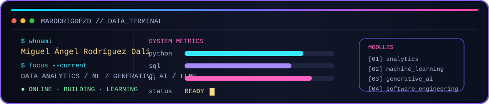

<!--
  Profile README for @marodriguezd
  Visual direction: retro developer dashboard / dark UI / neon accents.
-->

<p align="center">
  
</p>

<p align="center">
  
</p>

<p align="center">
  <a href="https://github.com/marodriguezd"></a>
  <a href="https://www.linkedin.com/in/marodriguezd/"></a>
  <a href="mailto:migueadali@gmail.com"></a>
  
</p>

---

<table>
<tr>
<td width="58%" valign="top">

### ABOUT ME

> **Analista de Datos + Desarrollador de Aplicaciones**, con foco actual en **Data Analytics, Python, SQL e IA**.

Me gusta construir herramientas reales y entender lo que ocurre bajo la superficie: desde análisis de datos y modelos de ML hasta aplicaciones de escritorio, APIs y automatización.

Mi dirección actual:

```text
$ cat profile.yml

role: junior-data-analyst
focus:
  - data-analytics
  - machine-learning
  - generative-ai
  - llms
secondary:
  - software-engineering
  - backend
```

</td>
<td width="42%" valign="top">

### SYSTEM STATUS

```text
[ OK ] Python
[ OK ] SQL
[ OK ] Pandas / NumPy
[ OK ] Statistics
[ OK ] ML / Deep Learning
[ OK ] Generative AI
[ OK ] Git / GitHub
[ OK ] Docker
```

<p align="center">
  
  
</p>

</td>
</tr>
</table>

## USE TO CODE

<p align="center">
  
  
  
  
  
  
  
  
  
  
  
  
  
  
  
  
</p>

<table>
<tr>
<td width="50%" valign="top">

### DATA / AI MODULE

- **Python + SQL** for data analysis and querying.
- **Pandas / NumPy / Statistics** for exploration and modelling.
- **Machine Learning / Deep Learning** for predictive work.
- **Generative AI / LLMs** for applied AI tooling.

</td>
<td width="50%" valign="top">

### SOFTWARE MODULE

- Desktop applications with **JavaFX** and **PyQt6**.
- REST APIs with **FastAPI** and **Spring Boot**.
- Persistence with **SQLite / PostgreSQL / MySQL / MongoDB**.
- Packaging and delivery with **Docker / CI/CD / GitHub Actions**.

</td>
</tr>
</table>

## FEATURED PROJECTS

<table>
<tr>
<td width="50%" valign="top">

### SRT4U

**Subtitle Processor**

Python 3.13 + PyQt6 desktop application with CLI, FastAPI, translation/transcription services, SQLite history, subtitle analytics/QA, FFmpeg, i18n and packaging.

<p>
<a href="https://github.com/marodriguezd/SRT4U"></a>
</p>

</td>
<td width="50%" valign="top">

### TASKFLOW

**Desktop Productivity Application**

Java 21 + JavaFX + SQLite with Pomodoro, persistence, history, themes, i18n, packaging and CI/CD.

<p>
<a href="https://github.com/marodriguezd/TaskFlow"></a>
</p>

</td>
</tr>
<tr>
<td width="50%" valign="top">

### VIDEO-SLICE-TUI

**Terminal-first video tooling**

A high-performance TUI for segmenting, trimming and merging video directly from the terminal.

</td>
<td width="50%" valign="top">

### YOUTUBE SUMMARIZER

**Transcription + summarization**

Telegram bot + CLI workflow for transcribing and summarizing YouTube videos with a Gemini-powered pipeline.

</td>
</tr>
</table>

## GITHUB STATS

<p align="center">
  
  
</p>

<p align="center">
  
</p>

<p align="center">
  
  
  
</p>

## TRAINING LOG

```text
2023  ── DAM · Desarrollo de Aplicaciones Multiplataforma
2025  ── EOI · Data Analytics · 253 h
2025  ── AWS · Generative AI Foundations
2026  ── HACK A BOSS · AI & Data · 196 h
2026  ── Anthropic · Claude Code in Action
```

<p align="center">
  <a href="https://github.com/marodriguezd"></a>
  <a href="https://www.linkedin.com/in/marodriguezd/"></a>
</p>

<p align="center">
  
</p>
