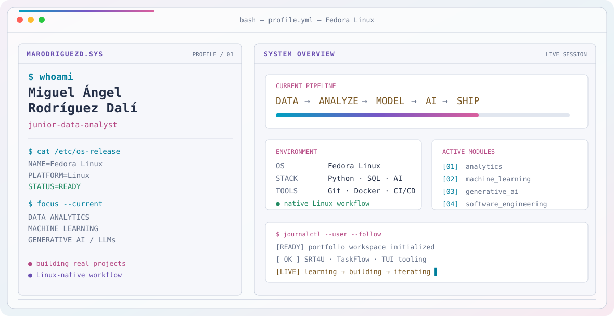
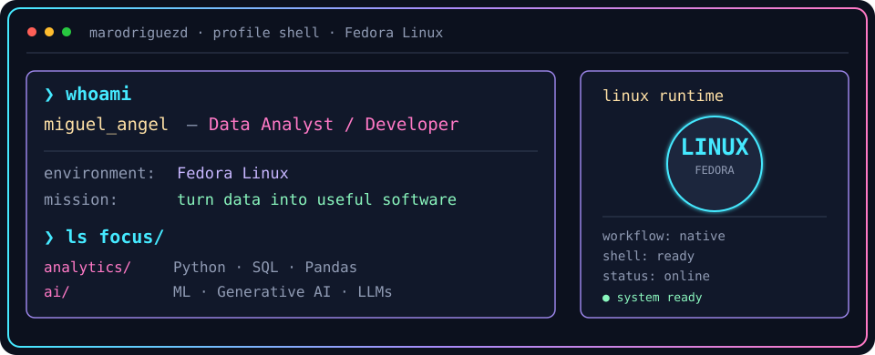
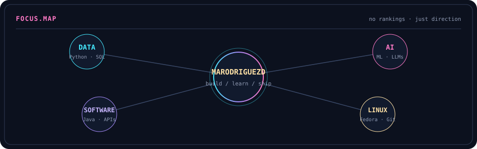
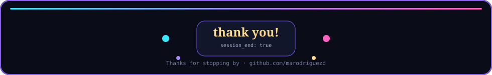

<!--
  @marodriguezd profile README
  Retro terminal / dashboard direction inspired by a custom developer workstation.
-->

<div align="center">

<picture>
  <source media="(prefers-color-scheme: dark)" srcset="assets/banner-dark.svg">
  <source media="(prefers-color-scheme: light)" srcset="assets/banner-light.svg">
  
</picture>

<br>

<a href="https://github.com/marodriguezd">
  
</a>


</div>

---

## `$ whoami`

<p align="center">
  
</p>

<br>

<div align="center">

## `$ cat tech-stack.yaml`

<table border="1" cellpadding="14" bgcolor="#101625">
  <thead>
    <tr>
      <th colspan="2" align="left"><code>marodriguezd:~$ cat tech-stack.yaml</code></th>
    </tr>
  </thead>
  <tbody>
    <tr>
      <td width="50%" valign="top">
        <code>├─ ◈ data_ai:</code><br><br>
        
        
        
        <br>
        
        
        
        <br>
        <sub><code>analysis · statistics · machine learning · generative AI</code></sub>
      </td>
      <td width="50%" valign="top">
        <code>├─ ◫ software_backend:</code><br><br>
        <br>
        <sub><code>Java · Spring Boot · FastAPI · SQLite · Docker</code></sub>
      </td>
    </tr>
    <tr>
      <td valign="top">
        <code>├─ ☁ databases_platform:</code><br><br>
        <br>
        <sub><code>PostgreSQL · MySQL · MongoDB · AWS</code></sub>
      </td>
      <td valign="top">
        <code>├─ ⚙ tooling_ci:</code><br><br>
        <br>
        <sub><code>Git · GitHub · GitHub Actions · Linux · CI/CD</code></sub>
      </td>
    </tr>
    <tr>
      <td valign="top">
        <code>╰─ ◌ desktop_i18n:</code><br><br>
        
        
        
        <br>
        <sub><code>desktop apps · packaging · internationalization · media tooling</code></sub>
      </td>
      <td valign="top">
        <code>╰─ ◉ environment:</code><br><br>
        
        
        <br>
        <sub><code>daily environment · Linux-native workflow</code></sub>
      </td>
    </tr>
  </tbody>
  <tfoot>
    <tr>
      <td colspan="2"><code>status: building · environment: Fedora Linux · mode: data + software + AI</code></td>
    </tr>
  </tfoot>
</table>

</div>

---

## `$ kubectl get focus --all-namespaces`

<p align="center">
  
</p>

<p align="center"><sub><code>direction: data analytics · machine learning · generative AI · software engineering · Linux</code></sub></p>

---

## `$ ls projects/`

<table>
<tr>
<td width="50%" valign="top">

### `01 / SRT4U`

**Subtitle Processor**

Python 3.13 + PyQt6 desktop application with CLI, FastAPI, translation/transcription services, SQLite history, subtitle analytics/QA, FFmpeg, i18n and packaging.

<p>
<a href="https://github.com/marodriguezd/SRT4U">

</a>
</p>

</td>
<td width="50%" valign="top">

### `02 / TASKFLOW`

**Desktop Productivity Application**

Java 21 + JavaFX + SQLite with Pomodoro, persistence, history, themes, i18n, packaging and CI/CD.

<p>
<a href="https://github.com/marodriguezd/TaskFlow">

</a>
</p>

</td>
</tr>
<tr>
<td width="50%" valign="top">

### `03 / VIDEO-SLICE-TUI`

**Terminal-first video tooling**

High-performance TUI for segmenting, trimming and merging video directly from the terminal.

</td>
<td width="50%" valign="top">

### `04 / YOUTUBE SUMMARIZER`

**Transcription + summarization**

Telegram bot + CLI workflow for transcribing and summarizing YouTube videos with a Gemini-powered pipeline.

</td>
</tr>
</table>

---

## `$ tail -f learning.log`

```text
2023  ── DAM · Desarrollo de Aplicaciones Multiplataforma
2025  ── EOI · Data Analytics · 253 h
2025  ── AWS · Generative AI Foundations
2026  ── HACK A BOSS · AI & Data · 196 h
2026  ── Anthropic · Claude Code in Action
```

---

## `$ git --stats`

<p align="center">
  
  
</p>

<p align="center">
  
</p>

<p align="center">
  
  
  
</p>

---

## `$ connect --socials`

<div align="center">

<a href="https://github.com/marodriguezd"></a>&nbsp;&nbsp;
<a href="https://www.linkedin.com/in/marodriguezd/"></a>&nbsp;&nbsp;
<a href="mailto:migueadali@gmail.com"></a>

<br><br>

<code>fedora@marodriguezd:~$ echo "thanks for stopping by"</code>

</div>

<p align="center">
  
</p>
